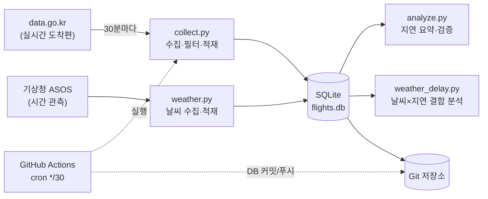

# ✈️ flight-delay-pipeline

> 김포공항(GMP) 실시간 도착편과 날씨를 **30분마다 자동 수집**하고, 편별 상태 변화를 시계열로 축적해 **"날씨가 나쁠 때 지연이 정말 늘어나는가"** 를 데이터로 검증하는 서버리스 데이터 파이프라인


---

## 📊 핵심 발견 — 비 오면 지연이 2배

가장 궁금했던 질문에 데이터로 답했다: **"비가 오면 항공편 지연이 정말 늘어나는가?"**

| 날씨 | 도착편 | 평균 지연 | 지연율 (15분 초과) |
| --- | ---: | ---: | ---: |
| 🌧️ 비 온 시각 | 278편 | **+4.4분** | **24.1%** |
| ☀️ 맑은 시각 | 2,361편 | −2.0분 | **12.1%** |

- **맑을 땐 평균 2분 일찍** 도착하지만, **비가 오면 평균 4.4분 늦어진다.**
- 15분 넘게 지연되는 비율이 **12% → 24%로 정확히 2배**로 뛴다.
- 시정(안개)이 나쁠 때도 지연율이 소폭 상승(13% → 19%)하는 경향이 보였다.

> 📌 **분석 기간** 2026.08.26 ~ 09.15 · 서울(108) ASOS 관측 기준 · 도착 확정편 2,639편

<details>
<summary>표본의 한계 (솔직하게)</summary>

- **날씨 지점 대체** — 김포공항엔 ASOS 관측 지점이 없어, 약 15km 거리의 **서울(108)** 관측으로 대체했다. 비·풍속·시정 같은 광역(廣域) 기상은 동일 날씨권으로 볼 수 있으나, 김포에만 낀 국지적 안개·순간 돌풍은 실제와 다를 수 있다.
- **강풍 표본 없음** — 분석 기간에 서울 풍속이 8m/s를 넘은 시각이 없어, 강풍-지연 관계는 아직 판단을 보류했다. 가을·겨울 데이터가 쌓이면 재검토 예정.
- **상관 ≠ 인과** — "비 온 시각에 지연율이 높다"는 상관관계이지, 비가 지연의 유일한 원인이라는 뜻은 아니다. (연결편 지연, 활주로 혼잡 등 다른 요인과 겹칠 수 있음)

</details>

---

## 📌 프로젝트 개요

항공편 지연·결항은 "지금 몇 편이 지연됐나"보다 **"어떤 편이, 언제, 어떻게 지연으로 바뀌었나"** 가 훨씬 가치 있는 정보다.
공공데이터포털은 *현재 시점*의 스냅샷만 주기 때문에, 이 프로젝트는 그 스냅샷을 주기적으로 떠서 **변화 이력을 직접 만들어 축적**한다.

여기에 더해, 항공 지연의 큰 원인 중 하나가 날씨라고 보고 **기상 관측 데이터도 함께 수집·결합**해서, 위의 "핵심 발견"처럼 날씨와 지연의 관계를 실제로 검증했다.

- **데이터 소스 ①** — 한국공항공사 실시간 항공기 운항정보 조회 API (`data.go.kr` / `B551178/flight-status/arrival`)
- **데이터 소스 ②** — 기상청 ASOS 시간자료 조회서비스 (`data.go.kr` / `AsosHourlyInfoService/getWthrDataList`)
- **수집 대상** — 김포공항(GMP) 도착편 + 서울(108) 시간별 기상 관측
- **운영 방식** — GitHub Actions 크론으로 30분마다 무인 실행 → DB를 저장소에 자동 커밋 (**별도 서버 0원**)

> 💡 처음엔 기상청 *단기예보* API를 썼으나, 예보는 "미래 추측값"이라 과거 특정 시각의 실제 날씨를 되짚을 수 없었다. 그래서 **실제 관측값(ASOS)** 으로 전환하고, 항공편이 쌓이기 시작한 8/26부터 과거 날씨를 **백필(backfill)** 해 결합 분석의 토대를 만들었다.

---

## 🏗️ 아키텍처



수집 → 적재 → 커밋까지 사람 손이 전혀 닿지 않는다. 저장소에 쌓인 `flights.db` 자체가 곧 데이터 자산.

---

## 💡 핵심 설계 포인트

| 설계 | 무엇을 | 왜 |
| --- | --- | --- |
| **멱등성(idempotent) UPSERT** | `ON CONFLICT(flight_key) DO UPDATE` 로 편별 1행 유지 | 같은 편을 몇 번 수집해도 중복이 쌓이지 않고 항상 최신 상태만 남김 |
| **변경 이력 추적 (CDC 개념)** | 상태·예상시각이 바뀔 때만 `flight_events` 에 1행 기록 | 스냅샷 API로는 알 수 없는 *"정상→지연→도착"* 전이 과정을 시계열로 복원 |
| **관측(예보 아님) 데이터 백필** | ASOS 시간자료를 과거 날짜 범위로 한 번에 적재 | 예보로는 불가능한 "과거 실제 날씨 × 지연" 결합의 토대 |
| **최근접 정각 매칭** | 항공편 예상도착시각 → 가장 가까운 정각 관측을 결합 | 서로 다른 주기(항공편=수시, 날씨=매시)의 두 소스를 시각 기준으로 엮음 |
| **서버리스 자동화 ETL** | GitHub Actions cron + `secrets` 로 키 관리 | 무료·무중단으로 24/7 수집. 인프라 유지비 없음 |
| **수집 로그 (관측성)** | 실행마다 `collection_log` 에 건수·성공여부 기록 | 파이프라인이 언제 얼마나 돌았는지 사후 검증 가능 |

---

## 🗃️ 데이터 모델

4개 테이블로 **현재 상태 / 변경 이력 / 실행 로그 / 날씨 관측**을 분리했다.

**`flights`** — 편별 현재 상태 (편당 1행)

| 컬럼 | 설명 |
| --- | --- |
| `flight_key` (PK) | 편명+날짜+출도착 조합 고유키 |
| `flight_id` / `airline` | 편명 · 항공사 |
| `scheduled_dt` / `estimated_dt` | 계획 시각 · 예상 시각 |
| `status` | 상태(도착/지연/결항 등) |
| `collected_at` / `updated_at` | 최초 수집 · 최종 갱신 시각 |

**`flight_events`** — 상태 변경 이력 (편당 N행) — *`status` 또는 `estimated_dt` 가 바뀔 때만 append*

**`collection_log`** — 수집 실행 기록 (실행당 1행) — 받아온 편 수 · 변경 편 수 · 성공 여부

**`weather`** — 시간별 기상 관측 (관측시각당 1행) — 서울(108) ASOS

| 컬럼 | 설명 |
| --- | --- |
| `stn_id` / `obs_time` | 관측 지점번호(108=서울) · 관측 시각 |
| `temp` / `rain` | 기온(℃) · 강수량(mm) |
| `wind_speed` / `humidity` | 풍속(m/s) · 습도(%) |
| `cloud` / `visibility` | 전운량(0~10) · 시정(m) |

> `UNIQUE(stn_id, obs_time)` 제약으로 같은 지점·시각의 중복 적재를 원천 차단 → 백필을 여러 번 돌려도 안전.

---

## 🛠️ 기술 스택

`Python 3.12` · `SQLite` · `urllib` · `json` · `datetime` (표준 라이브러리 위주) · `GitHub Actions`
> 외부 의존성을 최소화해서 GitHub Actions 러너에서 가볍게 돌아가도록 구성.

---

## 🚀 실행 방법

```bash
# 1. 저장소 클론
git clone https://github.com/jaehyuck46-cyber/flight-delay-pipeline.git
cd flight-delay-pipeline

# 2. API 키 설정 (data.go.kr에서 발급)
echo "KAC_SERVICE_KEY=항공편_키" > .env
echo "KMA_SERVICE_KEY=기상청_키" >> .env

# 3. 항공편 수집
python collect.py --inspect     # API 응답 미리보기 (저장 안 함)
python collect.py               # 수집 + DB 저장

# 4. 날씨 수집
python weather.py --inspect                     # 어제 관측 미리보기
python weather.py --backfill 20260826 20260915  # 과거 범위 백필
python weather.py                               # 어제치 수집 + 저장

# 5. 분석
python analyze.py               # 지연 요약·검증
python weather_delay.py         # 날씨 × 지연 결합 분석
```

---

## 📂 프로젝트 구조

```
flight-delay-pipeline/
├── db.py                        # DB 연결 · 테이블 4개 스키마 정의
├── collect.py                   # 항공편 API → GMP 필터 → UPSERT 적재
├── weather.py                   # ASOS API → 관측 수집·백필 → 적재
├── analyze.py                   # 지연 요약/검증
├── weather_delay.py             # 날씨 × 지연 결합 분석
├── data/flights.db              # 자동 커밋되는 SQLite (데이터 자산)
└── .github/workflows/collect.yml# 30분 주기 cron 자동화
```

---

## 🔭 향후 계획

- [x] 기상 관측(ASOS) 수집 + 과거 백필
- [x] 날씨 × 지연 결합 분석 → **"비 오면 지연율 2배" 검증 완료**
- [ ] 항공사·시간대별 지연 패턴에 날씨 축을 교차한 심화 분석
- [ ] 실시간 항공기 위치(ADS-B, OpenSky) 결합 → 지연편의 상공 선회대기(holding) 궤적 분석
- [ ] 관측소가 공항에 인접한 **제주(CJU)** 로 파이프라인 확장 → "지점 대체(김포) vs 완벽 매칭(제주)" 교차검증
- [ ] 파일 기반 SQLite → 컬럼 지향 포맷(Parquet) 이관 및 조회 성능 비교
