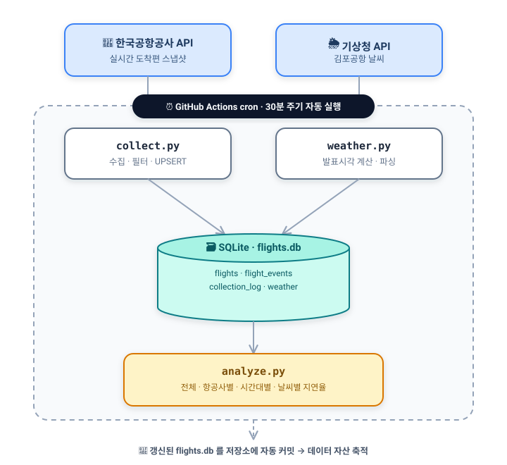

# ✈️ flight-delay-pipeline

> 김포공항(GMP) 실시간 도착편과 날씨를 **30분 주기로 자동 수집**하고,
> 편별 상태 변화를 시계열로 축적해 **지연 패턴을 분석**하는 서버리스 데이터 파이프라인

---

## 📌 이 프로젝트를 만든 이유

데이터 엔지니어가 되고 싶어서, 항공 도메인으로 **직접 굴러가는 파이프라인**을 하나 만들어보고 싶었다.

항공편 지연·결항은 "지금 몇 편이 지연됐나"보다 **"어떤 편이, 언제, 어떻게 지연으로 바뀌었나"** 가 훨씬 가치 있는 정보라고 생각했다. 그런데 공공데이터포털은 *현재 시점*의 스냅샷만 준다. 그래서 이 프로젝트는 그 스냅샷을 주기적으로 떠서 **변화 이력을 직접 만들어 축적**한다.

여기에 더해, 항공 지연의 큰 원인 중 하나가 날씨라고 생각해서 **기상청 날씨 데이터도 같이 수집**하도록 확장했다. 나중에 "날씨가 나쁠 때 정말 지연이 늘어나는가"를 데이터로 확인해보는 게 목표다.

- **데이터 소스 1** — 한국공항공사 실시간 항공기 운항정보 조회 API (`data.go.kr` / `B551178/flight-status/arrival`)
- **데이터 소스 2** — 기상청 단기예보 조회서비스 (`data.go.kr` / `VilageFcstInfoService_2.0/getVilageFcst`)
- **수집 대상** — 김포공항(GMP) 도착편 + 김포공항 날씨
- **운영 방식** — GitHub Actions 크론으로 30분 주기 무인 실행을 목표로 함 → DB를 저장소에 자동 커밋 (**별도 서버 0원**)

> ⚠️ 다만 GitHub Actions의 예약 실행(cron)은 플랫폼이 부하가 높은 시간대에 무료·공개 저장소 작업을 후순위로 미루거나 건너뛰기 때문에, 실제 수집 간격은 30분이 아니라 수 시간까지 벌어진다. GitHub 공식 문서도 예약 워크플로우의 정시 실행을 보장하지 않는다고 명시한다. 무료로 굴러간다는 장점은 유지하되, 정시성이 필요한 시점에는 AWS(EventBridge + Lambda)로 이관해 실행 시각을 보장할 계획이다.

---

## 🏗️ 아키텍처



바깥의 두 API가 데이터 소스이고, 수집 → 적재 → 분석의 전 과정을 **GitHub Actions cron이 감싸 무인으로 실행**한다. 사람 손이 전혀 닿지 않으며, 저장소에 쌓인 `flights.db` 자체가 곧 데이터 자산이다.

> 목표 주기는 30분이지만, 위에서 설명한 cron 특성상 실제 간격은 더 벌어질 수 있다. 정시성이 필요해지면 AWS(EventBridge + Lambda)로 이관할 계획이다.

---

## 💡 만들면서 신경 쓴 점

처음엔 그냥 "데이터 긁어서 저장"만 생각했는데, 막상 해보니 고민할 게 많았다. 그중 배운 것들:

| 설계 | 무엇을 | 왜 이렇게 했나 |
| --- | --- | --- |
| **멱등성(idempotent) UPSERT** | `ON CONFLICT(flight_key) DO UPDATE` 로 편별 1행 유지 | 같은 편을 몇 번 수집해도 중복이 쌓이지 않고 항상 최신 상태만 남기려고 |
| **변경 이력 추적 (CDC 개념)** | 상태·예상시각이 바뀔 때만 `flight_events` 에 1행 기록 | 스냅샷 API로는 알 수 없는 *"정상→지연→도착"* 전이 과정을 시계열로 복원하려고 |
| **서버리스 자동화 ETL** | GitHub Actions cron + `secrets` 로 키 관리 | 내 PC를 안 켜도 24/7 수집되게. 인프라 유지비 0원 |
| **수집 로그 (관측성)** | 실행마다 `collection_log` 에 건수·성공여부 기록 | 파이프라인이 언제 얼마나 돌았는지 나중에 검증할 수 있게 |
| **API 키 분리 관리** | `.env` + `.gitignore` + GitHub Secrets | 키가 실수로 공개 저장소에 올라가지 않게 (직접 겪고 배운 부분) |

---

## 🗃️ 데이터 모델

4개 테이블로 **현재 상태 / 변경 이력 / 실행 로그 / 날씨**를 분리했다.

**`flights`** — 편별 현재 상태 (편당 1행)

| 컬럼 | 설명 |
| --- | --- |
| `flight_key` (PK) | 편명+날짜+출도착 조합 고유키 |
| `flight_id` / `airline` | 편명 · 항공사 |
| `scheduled_dt` / `estimated_dt` | 계획 시각 · 예상 시각 |
| `status` | 상태(도착/결항/회항 등) |
| `collected_at` / `updated_at` | 최초 수집 · 최종 갱신 시각 |

**`flight_events`** — 상태 변경 이력 (편당 N행) — *`status` 또는 `estimated_dt` 가 바뀔 때만 기록*

**`collection_log`** — 수집 실행 기록 (실행당 1행) — 받아온 편 수 · 변경 편 수 · 성공 여부

**`weather`** — 김포공항 날씨 스냅샷 (수집 시각당 1행)

| 컬럼 | 설명 |
| --- | --- |
| `fcst_date` / `fcst_time` | 예보 대상 날짜 · 시각 |
| `temp` / `humidity` | 기온(℃) · 습도(%) |
| `rain_type` / `rain_prob` | 강수형태 · 강수확률(%) |
| `sky` / `wind_speed` | 하늘상태 · 풍속(m/s) |
| `collected_at` | 이 날씨를 수집한 시각 |

---

## 📊 분석 결과 (2026-08-29 ~ 09-11 수집분)

> 저장소에 자동 커밋된 `flights.db` 기준. 데이터가 더 쌓이면 숫자는 계속 갱신된다.

**대상** — 도착 완료(`status = '도착'`)이고 계획·예상 시각이 모두 있는 **2,950편**.
지연 기준은 항공업계 표준 **15분** (지연 = 예상 도착시각 − 계획 도착시각).

### 전체 지연율

| 기준 | 편수 | 비율 |
| --- | --- | --- |
| 15분 이상 지연 | 426 / 2,950 | **14.4%** |
| 0분 초과 지연 | 1,042 / 2,950 | 35.3% |

### 항공사별 15분 지연율 (20편 이상, 높은 순)

이 기간 데이터에서는 대형 항공사가 저비용항공사(LCC)보다 정시성이 좋게 나왔다. (아직 표본이 작아 더 쌓이면 달라질 수 있다.)

| 항공사 | 편수 | 15분 지연율 |
| --- | --- | --- |
| 이스타항공 | 360 | 29.4% |
| 제주항공 | 467 | 20.1% |
| 진에어 | 213 | 16.0% |
| **대한항공** | 549 | **12.4%** |
| 아시아나항공 | 413 | 10.2% |
| 티웨이항공 | 303 | 9.9% |
| 에어부산 | 189 | 6.3% |

### 시간대별 15분 지연율

아침(7~8시)은 지연이 거의 없다가 **오후 2시(27.4%)와 저녁 6시(27.9%)에 정점**을 찍는다.
앞 비행기의 지연이 뒤 시간대로 누적되는 패턴으로 보인다.

```
07시   2.1%  █
08시   0.0%
09시   4.8%  ██
10시   9.4%  █████
11시   8.8%  ████
12시   5.3%  ███
13시  11.4%  ██████
14시  27.4%  ██████████████  ◀ 정점
15시  19.8%  ██████████
16시  17.0%  ████████
17시  18.1%  █████████
18시  27.9%  ██████████████  ◀ 정점
19시  18.2%  █████████
20시  12.6%  ██████
21시  10.3%  █████
22시  16.3%  ████████
```

> 지금은 약 2주 치라 표본이 작다. 특히 오늘(수집 시점) 데이터가 비어 있는 날이 있는데, 이는 위에서 설명한 **GitHub Actions cron의 지연 실행** 때문이다 — 파이프라인의 실제 한계가 데이터에 그대로 드러난 셈이다.

---

## 🌦️ 날씨 매칭 현황과 한계 — 예보에서 관측(ASOS)으로 바꾸는 이유

이 프로젝트의 최종 목표는 **"날씨가 나쁠 때 정말 지연이 느는가"** 를 데이터로 확인하는 것이다.
그러려면 편마다 그 시각의 날씨를 붙여야 하는데(계획시각 기준 ±90분 최근접 매칭), 지금 방식은 두 벽에 부딪혔다.

### ① 매칭률이 낮다 — 2,950편 중 841편만 매칭 (28.5%)

`weather` 테이블에 쌓인 게 **45건뿐**이라, 편의 약 71%는 붙일 날씨가 없다. 원인은 두 겹이다.

- 기상청 **단기예보 API**는 한 번 호출에 여러 시점 예보가 오는데, 현재 코드가 그중 **1시점만 저장하고 나머지를 버린다.**
- 날씨 수집을 항공편보다 **늦게(9/2~) 시작**해서, 항공편(8/29~)과 겹치는 구간이 짧다.

### ② 매칭된 것마저 전부 '맑음'이라 비교가 불가능

매칭에 성공한 841편의 날씨가 **100% 강수 없음(맑음)** 이다. 비·눈이 온 시각의 데이터가 **0건**이라, 정작 궁금한 *"악천후일 때 vs 맑을 때"* 비교 자체가 성립하지 않는다.

### → 그래서 예보(fcst)에서 관측(ASOS)으로 전환한다

| 구분 | 지금: 단기예보 API | 바꿀 것: 관측(ASOS) API |
| --- | --- | --- |
| **과거 데이터** | 못 가져옴 (미래 예보 위주) | **소급 수집(백필) 가능** → 8/29치부터 채움 |
| **매칭률** | 28.5% | 이미 쌓인 편 대부분에 붙일 수 있을 것으로 기대 |
| **날씨 변수** | 예보 하늘상태·강수확률 | **실제 강수량·시정(가시거리)** 확보 — 항공 지연의 핵심 변수 |

관측 데이터는 **과거를 소급해 채울 수 있어**, 이미 쌓인 항공편 대부분에 날씨를 붙일 수 있을 것으로 기대한다. 예보엔 없는 **실제 강수량과 시정**도 함께 얻을 수 있다. **백필(과거 데이터 채우기)** 은 실무에서도 자주 쓰인다고 하니, 이번 전환을 계기로 직접 해보며 익혀볼 생각이다.

> 참고: 김포공항 자체에는 ASOS 관측 지점이 없어(공항 관측은 METAR/TAF 소관), 가장 가까운 서울(지점번호 108) 관측값을 대안으로 검토 중이다. 약 15km 거리라 국지적 안개 등은 못 잡는 한계가 있으며, 이 점은 문서에 명시해 둘 예정이다.

---

## 🛠️ 기술 스택

`Python 3.12` · `SQLite` · `urllib` · `xml.etree` · `json` · `GitHub Actions`

> 표준 라이브러리 위주로 짜서 외부 의존성을 최소화했다. GitHub Actions 러너에서 가볍게 돌아가게 하려고.

---

## 🚀 실행 방법

```bash
# 1. 저장소 클론
git clone https://github.com/jaehyuck46-cyber/flight-delay-pipeline.git
cd flight-delay-pipeline

# 2. API 키 설정 (data.go.kr에서 발급, 계정당 인증키 하나로 두 API 공용)
#    .env 파일에 아래 두 줄을 넣는다
#    KAC_SERVICE_KEY=발급받은_키   ← 항공편용
#    KMA_SERVICE_KEY=발급받은_키   ← 날씨용 (같은 키)

# 3. API 응답 미리보기 (저장 안 함)
python collect.py --inspect     # 항공편
python weather.py --inspect     # 날씨

# 4. 수집 + DB 저장
python collect.py
python weather.py

# 5. 쌓인 데이터 요약·지연율 분석 확인
python analyze.py
```

---

## 📂 프로젝트 구조

```
flight-delay-pipeline/
├── db.py                         # DB 연결 · 테이블 4개 스키마 정의
├── collect.py                    # 항공편 API → GMP 필터 → UPSERT 적재
├── weather.py                    # 기상청 API → 발표시각 계산 → 날씨 적재
├── analyze.py                    # 요약 + 지연율(전체·항공사별·시간대별·날씨별) 분석
├── data/flights.db               # 자동 커밋되는 SQLite (데이터 자산)
└── .github/workflows/collect.yml # 30분 주기 cron 자동화
```

---

## 🔭 앞으로 할 것

- [x] 항공사·시간대별 지연 패턴 분석 (`analyze.py` 에 구현)
- [ ] **예보→관측(ASOS) 전환** — 과거 데이터 백필로 flights×weather 매칭률 개선 (현재 28.5% → 대폭 향상 목표)
- [ ] **날씨 × 지연 결합 분석** — "비/강풍일 때 지연·결항이 실제로 늘어나는가" (이 프로젝트의 최종 목표)
- [ ] 지연율 분석 결과를 매일 자동 리포트로 저장 (분석까지 자동화)
- [ ] 파일 기반 SQLite → 컬럼 지향 포맷(Parquet) 이관 및 조회 성능 비교
- [ ] **AWS 이관** — GitHub Actions cron의 지연 실행 한계 해소 (EventBridge + Lambda로 정시 수집 보장)

---

## 💭 떠오른 아이디어 (언제든 추가)

계획한 것 말고, 하다가 문득 떠오른 것들을 여기에 그냥 적어둔다.
지금 할 건 아니어도, 나중에 이 중 하나가 프로젝트를 더 재밌게 만들 수도 있으니까.

- (예시) 회항·결항이 발생한 시각의 날씨를 따로 모아보기 — 악천후랑 정말 관련 있을까?
- (예시) 특정 항공사가 유독 잘 지연되는 노선이 있는지 (출발 공항별로 쪼개보기)
- (예시) 지연이 "정상 → 지연 → 결항"으로 번지는 데 보통 몇 분 걸리는지 (flight_events 활용)

> 여기에 계속 덧붙여 나갈 예정. 아이디어는 원래 갑자기 나는 거니까.

---

## 🧭 어떻게 만들고 있나

**프로젝트 시작: 2026년 8월 29일.** 아직 배우는 중인 1학년 학생의 프로젝트다.

이 저장소의 설계·코드·문서는 **AI 도구(Claude)와 함께** 만든다. 다만 받은 걸 그대로 붙여넣고 넘어가지 않으려고, 프로젝트 규칙(`CLAUDE.md`)에 몇 가지를 걸어뒀다.

- **변경 전 diff를 먼저 확인**하고 넘어가기 — 뭐가 왜 바뀌는지 모르고 지나가지 않으려고
- **설명·커밋 메시지는 한국어로** 남기기 — 내가 읽고 이해할 수 있는 말로 정리하려고
- 모르는 개념(멱등성·CDC·cron 지연·백필 등)은 그때그때 찾아 이해한 뒤 반영하기

그래서 이 저장소는 "완성된 결과물"이라기보다, **AI를 도구로 쓰면서 데이터 엔지니어링의 원리를 하나씩 배워가는 학습 기록**에 가깝다. 설계 결정의 근거를 문서에 남기는 것도, 나중의 내가 *"왜 이렇게 했지"* 를 되짚어보기 위해서다.

> 아직 완성되지 않은, 배우는 중인 데이터 엔지니어의 기록입니다.
> 수집부터 자동화·분석까지 직접 굴려보며, *왜 그렇게 되는지* 를 이해하는 걸 목표로 합니다.
