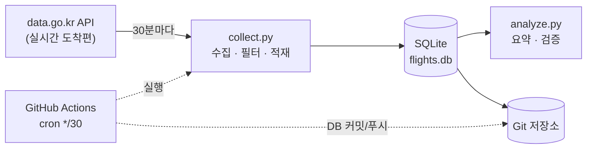

# ✈️ flight-delay-pipeline

> 김포공항(GMP) 실시간 도착편 데이터를 **30분마다 자동 수집**하고, 편별 상태 변화를 시계열로 축적하는 서버리스 데이터 파이프라인


---

## 📌 프로젝트 개요

항공편 지연·결항은 "지금 몇 편이 지연됐나"보다 **"어떤 편이, 언제, 어떻게 지연으로 바뀌었나"** 가 훨씬 가치 있는 정보다.
공공데이터포털은 *현재 시점*의 스냅샷만 주기 때문에, 이 프로젝트는 그 스냅샷을 주기적으로 떠서 **변화 이력을 직접 만들어 축적**한다.

- **데이터 소스** — 한국공항공사 실시간 항공기 운항정보 조회 GW API (`data.go.kr` / `B551178/flight-status/arrival`)
- **수집 대상** — 김포공항(GMP) 도착편
- **운영 방식** — GitHub Actions 크론으로 30분마다 무인 실행 → DB를 저장소에 자동 커밋 (**별도 서버 0원**)

---

## 🏗️ 아키텍처



수집 → 적재 → 커밋까지 사람 손이 전혀 닿지 않는다. 저장소에 쌓인 `flights.db` 자체가 곧 데이터 자산.

---

## 💡 핵심 설계 포인트

| 설계 | 무엇을 | 왜 |
|------|--------|-----|
| **멱등성(idempotent) UPSERT** | `ON CONFLICT(flight_key) DO UPDATE` 로 편별 1행 유지 | 같은 편을 몇 번 수집해도 중복이 쌓이지 않고 항상 최신 상태만 남김 |
| **변경 이력 추적 (CDC 개념)** | 상태·예상시각이 바뀔 때만 `flight_events` 에 1행 기록 | 스냅샷 API로는 알 수 없는 *"정상→지연→도착"* 전이 과정을 시계열로 복원 |
| **서버리스 자동화 ETL** | GitHub Actions cron + `secrets` 로 키 관리 | 무료·무중단으로 24/7 수집. 인프라 유지비 없음 |
| **수집 로그 (관측성)** | 실행마다 `collection_log` 에 건수·성공여부 기록 | 파이프라인이 언제 얼마나 돌았는지 사후 검증 가능 |

---

## 🗃️ 데이터 모델

3개 테이블로 **현재 상태 / 변경 이력 / 실행 로그**를 분리했다.

**`flights`** — 편별 현재 상태 (편당 1행)

| 컬럼 | 설명 |
|------|------|
| `flight_key` (PK) | 편명+날짜+출도착 조합 고유키 |
| `flight_id` / `airline` | 편명 · 항공사 |
| `scheduled_dt` / `estimated_dt` | 계획 시각 · 예상 시각 |
| `status` | 상태(도착/지연/결항 등) |
| `collected_at` / `updated_at` | 최초 수집 · 최종 갱신 시각 |

**`flight_events`** — 상태 변경 이력 (편당 N행) — *`status` 또는 `estimated_dt` 가 바뀔 때만 append*

**`collection_log`** — 수집 실행 기록 (실행당 1행) — 받아온 편 수 · 변경 편 수 · 성공 여부

---

## 🛠️ 기술 스택

`Python 3.12` · `SQLite` · `urllib` · `xml.etree` (표준 라이브러리 위주) · `GitHub Actions`

> 외부 의존성을 최소화해서 GitHub Actions 러너에서 가볍게 돌아가도록 구성.

---

## 🚀 실행 방법

```bash
# 1. 저장소 클론
git clone https://github.com/jaehyuck46-cyber/flight-delay-pipeline.git
cd flight-delay-pipeline

# 2. API 키 설정 (data.go.kr에서 발급)
echo "KAC_SERVICE_KEY=발급받은_키" > .env

# 3. API 응답 미리보기 (저장 안 함)
python collect.py --inspect

# 4. 수집 + DB 저장
python collect.py

# 5. 쌓인 데이터 요약 확인
python analyze.py
```

---

## 📂 프로젝트 구조

```
flight-delay-pipeline/
├── db.py                        # DB 연결 · 테이블 3개 스키마 정의
├── collect.py                   # API 호출 → GMP 필터 → UPSERT 적재
├── analyze.py                   # 저장된 데이터 요약/검증
├── data/flights.db              # 자동 커밋되는 SQLite (데이터 자산)
└── .github/workflows/collect.yml# 30분 주기 cron 자동화
```

---

## 🔭 향후 계획

- [ ] 축적된 이력으로 **지연 확정 시점 분석** (예상시각이 몇 번, 얼마나 밀리다 결항으로 가는지)
- [ ] 항공사·시간대별 지연 패턴 시각화
- [ ] 파일 기반 SQLite → 컬럼 지향 포맷(Parquet) 이관 및 조회 성능 비교
